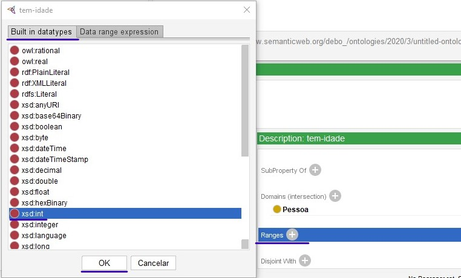
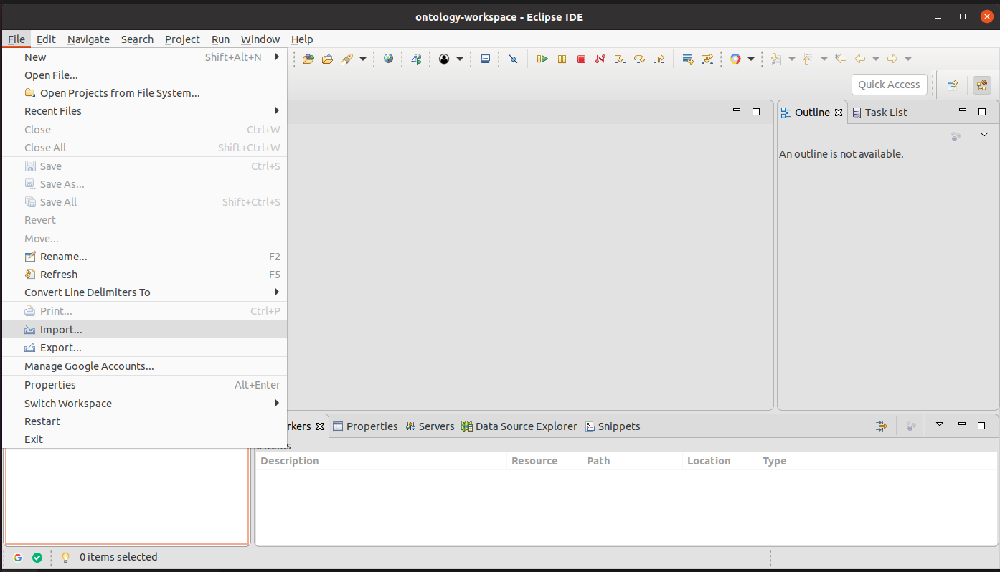
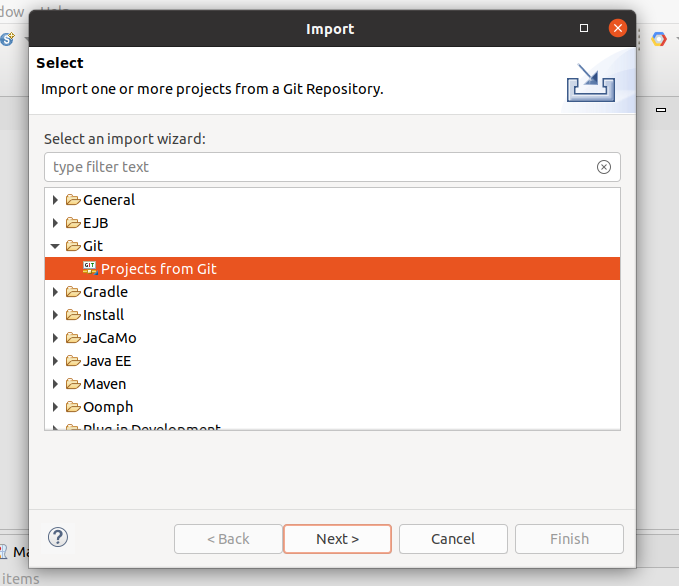
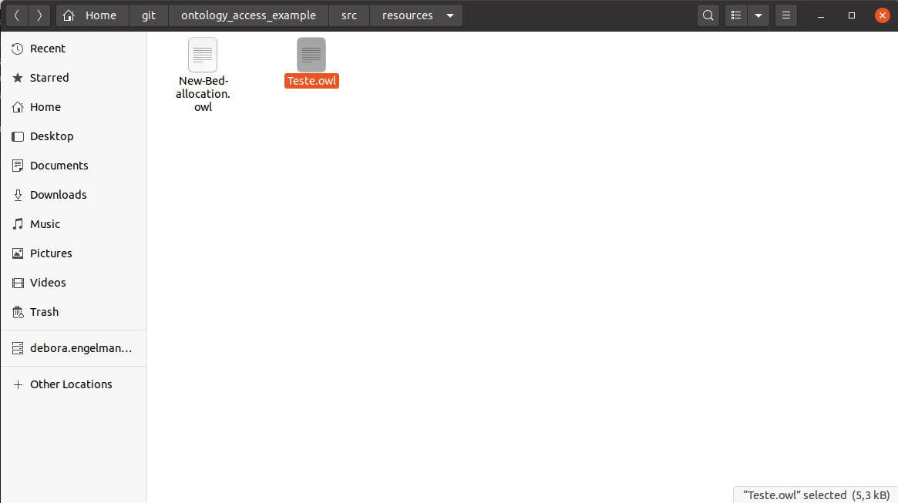

# Jason + Ontologias

By [Débora Engelmann](https://github.com/DeboraEngelmann)


Você precisará ter instalado em seu computador:

[Git](https://git-scm.com/downloads), 
[Java SE 8](https://www.oracle.com/java/technologies/javase-jdk8-downloads.html), 
[Eclipse](https://www.eclipse.org/downloads/) - Oxygen ou superior, 
[JaCaMo](http://jacamo.sourceforge.net/eclipseplugin/tutorial/) e 
[Protégé](https://protege.stanford.edu/)


**Use a seguinte lista para navegar para o tutorial correspondente a cada tarefa**

1. [Criação de Ontologia usando Protégé](#criação-de-ontologia-usando-protégé)
2. [Buscando Informações em Ontologia Usando Agentes Jason](#buscando-informações-em-ontologia-usando-agentes-jason)


## Criação de Ontologia usando Protégé


Para adicionar novas classes clique em `Entities` em seguida selecione `owl:Thing` e clique no ícone para adicionar uma nova classe:


Digite o nome da classe e clique em OK:


Os ícones nos dão a opção de criar uma sub-classe da classe que está selecionada, criar uma nova classe ou excluir a classe selecionada.


Para adicionar as relações que existem entre as classes selecione a aba `Object properties`:


Clique no ícone para adicionar uma propriedade, insira o nome da propriedade e clique em OK:


Agora no item `Description` vamos selecionar o `Domain` e o `Range` da nossa `Object property`:


Clique no símbolo de mais (+) ao lado do `Domains`, selecione a classe desejada e clique em OK.


Repita o processo para o `Range`.


Da mesma forma que nas `Classes`, as `Object properties` também tem os ícones para criar uma `sub-property` da `property` que está selecionada, criar uma nova `property` ou excluir a `property` selecionada.


Quando temos duas Object Properties inversas podemos informar isso através do Inverse Of:


Na aba `Data properties` podemos adicionar dados referentes ás classes:


Nesse caso, no `Domain` será selecionada a classe e no `Range` será informado o tipo de dado que aquela `Data property` espera.



Na aba `Individuals` podemos criar instâncias para as nossas classes:


Clique no ícone para adicionar uma nova instância, informe o nome e clique em OK.


Nos itens `Description` e `Property assertions` podemos informar os dados referentes á nossa instância.


Para dizer que a instância pertence a uma classe selecionamos a classe no `Types`.


Em `Object property assertions` podemos relacionar a instância com outras instâncias através das `Object properties`:


Em `Data property assertions` podemos informar dados referentes á nossa instância através das `Data properties`:


Caso o item `Rules` não esteja aparecendo, podemos localiza-lo através do menu `Window/Views/Ontology views/Rules`.


No item `Rules` podemos criar regras para as nossas ontologias utilizando a sintaxe [SWRL](https://www.w3.org/Submission/SWRL/). Por exemplo, se quisermos criar uma regra que diga que se uma pessoa executa uma tarefa, e essa tarefa acontece em um local, então a pessoa está nesse mesmo local, podemos fazer isso dessa forma: executa(?P, ?T), ocorre-em(?T, ?L) -> esta-em(?P, ?L)


Para executar essas regras e gerar inferências precisamos de um raciocinador. Vamos utilizar o `Pellet`. Para instalar ele acesse o menu `File/Check for plugins...`.


Na caixa de diálogo que abrir selecione `Pellet Reasoner Plug-in` (é necessário marcar o checkbox) e clique em `Install`.


A seguinte mensagem será apresentada, clique em OK.


Antes de fecharmos a aplicação e abrir novamente, vamos salvar nossa ontologia. Para isso selecione `File/Save` ou digite `CTRL+S`.


Na caixa de diálogo selecione `OWL/XML Syntax` e clique em OK.


Selecione a pasta onde a ontologia deve ser salva, dê um nome e clique em `Salvar`.


Agora podemos fechar o Protégé e abrir novamente. Selecione o menu `File/Open...` ou digite `CTRL+O`. Na caixa de diálogo que abrir selecione a pasta onde a ontologia está salva, selecione a ontologia e clique em `Abrir`.


Selecione a aba `Entities`, em seguida a aba `Individuals` e selecione alguma instância.


Em seguida selecione o menu `Reasoner/Pellet` para selecionar o raciocinador `Pellet`, em seguida selecione o menu `Reasoner/Start reasoner` ou digite `CTRL+R` para iniciar o raciocínio. As inferências feitas pelo raciocinador aparecerão destacadas em amarelo.


## Buscando Informações em Ontologia Usando Agentes Jason


Abra o `Eclipse` e selecione o menu `File/Import`.



Na Caixa de diálogo selecione `Git/Projects from Git` e clique em `Next >`



Selecione a opção `Clone URI` e clique em `Next >` novamente. Em `URI` coloque o link: https://github.com/DeboraEngelmann/ontology_access_example.git e clique em `Next >`.


Selecione `master` e clique em `Next >`. Escolha o diretório onde o projeto será salvo e clique em `Next >`.


Selecione a opção Import existing Eclipse projects e clique em `Next >`.


Clique em `Finish`.


Caso ainda não esteja selecionada, selecione a perspectiva JaCaMo através do menu `Window/Perspective/Open Perspective/Other...`


Na caixa de diálogo que abrir selecione `JaCaMo` e clique em `Open`.


Para rodar o projeto clique com o botão direito no arquivo `ontology_access_example.jcm` e selecione `Run Jacamo Application`


Assim veremos nossos agentes fazendo consultas em uma ontologia:


Para trocar a ontologia em que ele está fazendo consulta pela que acabamos de criar, precisamos colocar a nossa ontologia na pasta `src/resources`. Para isso, clique com o botão direito na pasta `src/resources` e selecione `Show in/System Explorer`.


Entre na pasta `resources`.


Cole nessa pasta a ontologia criada anteriormente.



Agora vamos criar um novo agente para efetuar consultas na nossa ontologia de teste. Clique com o botão direito em `src/agt/inc` e selecione `new/Asl File`.


Nomeie o agente e clique em Finish.


Agora, substitua o código de exemplo criado automaticamente no agente pelo código a seguir.

```
!start.

+!start 
	: true 
<- 
	.print("Test agent enabled.")
	.print("Let's use an ontology");
	!fillTheBeliefBase;	
	
	.print("Getting DataProperties in ontology");
	getDataPropertyNames(DataPropertyNames);
	!print("DataPropertyNames",DataPropertyNames);
	
	.print("Getting Instances of Pessoa");
	!getInstances(pessoa, Instances)
	!print("Instances",Instances);
	
	.print("Checking if Fulano performs the task Ir-para-aula");
	!isRelated("Fulano", executa, "Ir-para-aula", IsRelated);
	.print("Fulano performs the task Ir-para-aula = ", IsRelated);
	
	.
	
+!print(_,[]).	
+!print(Type,[H|T])
<-
	.print(Type," : ", H);
	!print(Type, T);
	.

+!fillTheBeliefBase
<- 
	.print("Getting classes in ontology");
	getClassNames(ClassNames);
	.print("Adding Classes to the belief base");
	!addToTheBeliefBase(ClassNames);
	.print("Getting ObjectProperties in ontology");
	getObjectPropertyNames(ObjectPropertyNames);
	.print("Adding ObjectProperties to the belief base");
	!addToTheBeliefBase(ObjectPropertyNames);
	.

+!addToTheBeliefBase([]).	
+!addToTheBeliefBase([H|T])
<-
	+H;
	.print("Ontology information added to belief base: ", H)
	!addToTheBeliefBase(T)
	.

+!isRelated(Domain, Property, Range, IsRelated)
 	: objectProperty(PropertyName,Property)
<-
	isRelated(Domain, PropertyName, Range, IsRelated);
	.print("Domain: ", Domain, " PropertyName: ", PropertyName, " Range: ", Range, " IsRelated: ", IsRelated);
	.
	
+!addInstance(InstanceName, Concept)
	: concept(ClassName,Concept)
<- 
	.print("Adding a new ", ClassName, " named ", InstanceName);
	addInstance(InstanceName, ClassName);
	!getInstances(Concept, Instances);
	!print("Instances", Instances);
	.

+!isInstanceOf(InstanceName, Concept, Result)
	: concept(ClassName,Concept)
<- 
	.print("Checking if ", InstanceName, " is an instance of ", ClassName);
	isInstanceOf(InstanceName, ClassName, Result);
	.print("The result is ", Result);
	!getInstances(Concept, Instances);
	!print("Instances", Instances);
	.

+!getInstances(Concept, Instances)
	: concept(ClassName,Concept)
<-
	.print("Getting instances of ", ClassName);
	getInstances(ClassName, Instances);
	.
	
+!getObjectPropertyValues(Domain, Property, Range)
 	: objectProperty(PropertyName,Property)
<-
	getObjectPropertyValues(Domain, PropertyName, Range);
	.print("Domain: ", Domain, " PropertyName: ", PropertyName, " Range: ", Range);
	.

{ include("$jacamoJar/templates/common-cartago.asl") }
{ include("$jacamoJar/templates/common-moise.asl") }

// uncomment the include below to have an agent compliant with its organisation
//{ include("$moiseJar/asl/org-obedient.asl") }

```

Para dizer ao nosso agente qual ontologia deve ser consultada, precisamos alterar o caminho da ontologia em `ontology_access_example.jcm`. Vamos trocar o `New-Bed-allocation.owl` pelo nome da nossa ontologia.


Vamos precisar também declarar nosso agente no `ontology_access_example.jcm` e comentar os outros dois para podemos visualizar apenas nosso agente em ação.

```
    agent test:test_agent.asl{
    	focus: onto
    }
```


Agora, se rodarmos nosso projeto novamente veremos que nosso agente já está buscando as informações na nova ontologia.


Se inspecionarmos a base de crenças clicando no botão `Debug` e selecionando o nosso agente podemos ver algumas informações da ontologia já adicionadas na base de crenças.

